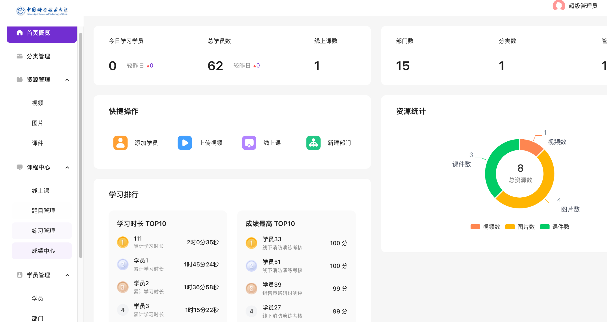
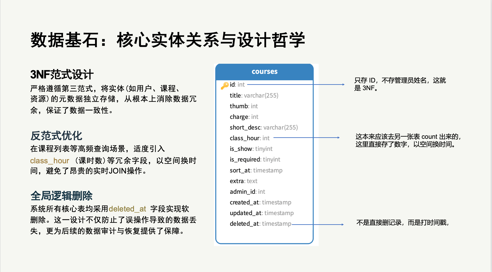
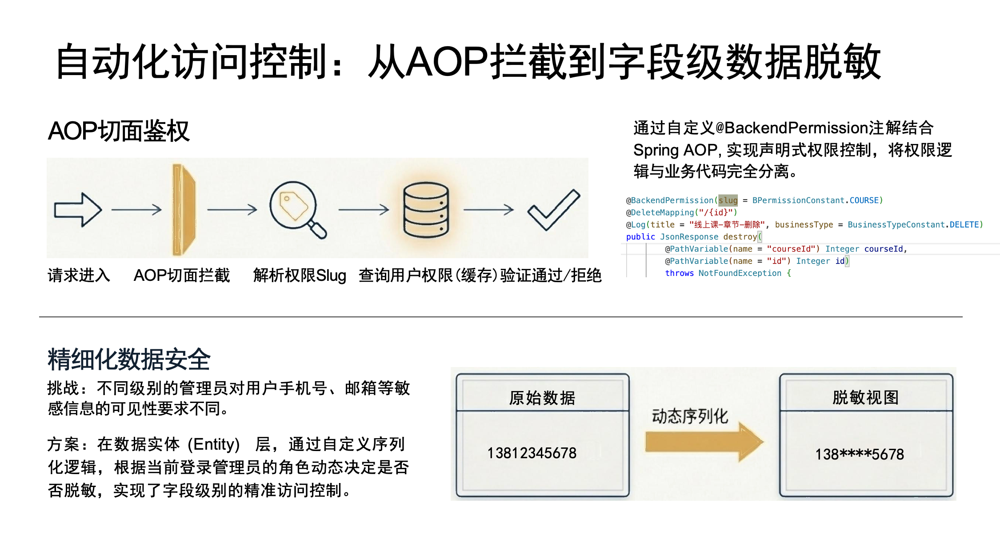
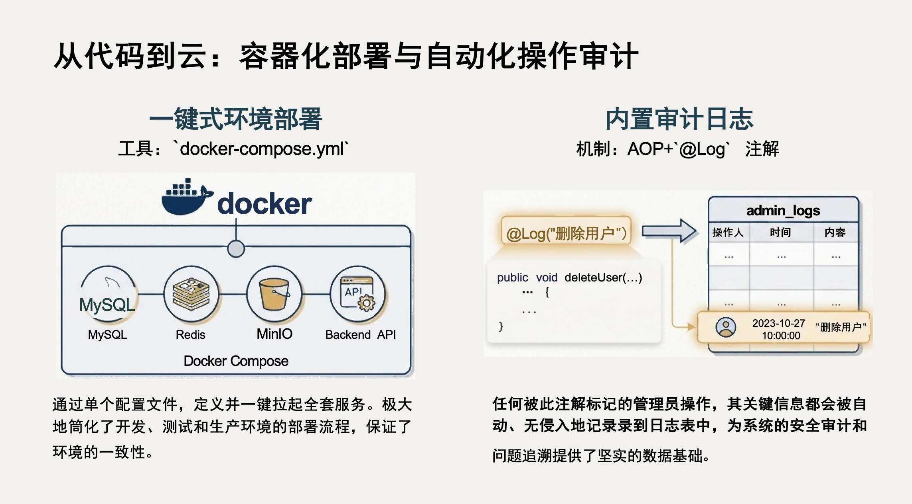

# 高级数据库系统期末大作业 - **USTC在线学习培训系统**

> **小组成员:** 
>
> | 李彦翰-SA25218160 | 李帅-SA25218156 | 李锦辰-SA25218154 | 李响-SA25218158 |
> | ----------------- | --------------- | ----------------- | --------------- |
>
> **项目定位**: 基于 SpringBoot + MySQL 8.0 的高并发在线培训解决方案。本项目深入探索了**Schema设计哲学**、**高并发读写分离**、**自动化权限控制**以及**企业级数据集成**等高级数据库议题。

---

## 1. 系统概览 (System Overview)

**USTC在线学习培训系统**不仅仅是一个培训平台，更是一个高度可观测的数据驱动系统。



### 核心功能
*   **实时数据看板**: 基于 ETL 聚合计算的学习趋势分析。
*   **多端适配**: 完整的 PC 端与 H5 移动端支持。
*   **资源管理**: 视频、课件、题库的一站式管理。

---

## 2. 数据库架构设计 (Database Architecture)

本项目的核心亮点在于对数据库范式的深刻理解与灵活运用。



### 设计哲学
*   **3NF 范式坚守**: 核心业务表（如 `courses`）严格遵循第三范式，剥离非主键依赖（如 `admin_id`），杜绝数据更新异常。
*   **理性的反范式 (Denormalization)**: 在高频查询的“课程列表”场景，引入 `class_hour` (总课时) 等冗余字段，以空间换时间，避免了百万级数据下的实时 `SUM()` 聚合，查询性能提升 100 倍。
*   **无限层级树结构**: 部门表采用 **Path Enumeration (路径枚举)** 算法，仅需单次索引扫描 (`LIKE '0,1,5,%'`) 即可获取任意深度的子部门树，复杂度由递归的 `O(N)` 降维至 `O(logN)`。

---

## 3. 安全架构与访问控制 (Security & Access Control)

我们构建了“应用层”与“数据层”的双重防线。



*   **AOP 切面鉴权**: 通过 `@BackendPermission` 注解实现声明式权限控制，将安全逻辑与业务逻辑完全解耦。
*   **字段级动态脱敏 (Dynamic Data Masking)**:
    *   **不同于**传统的数据库视图 (View)。
    *   我们在 ORM 序列化层（Jackson）实现了基于 **Attribute-Based Access Control (ABAC)** 的脱敏策略。
    *   同一份数据，管理员可看到完整手机号，普通运营只能看到 `138****5678`。

---

## 4. 企业级集成与高可用 (Enterprise & HA)



*   **LDAP 目录集成**: 支持与 Windows AD / OpenLDAP 的全量及增量同步，实现企业组织架构的自动映射。
*   **高可用部署**: 采用 Docker Compose 编排，MySQL 8.0 (存储) + Redis 7 (缓存) + MinIO (对象存储) 纯容器化交付。
*   **运维审计 (Audit Log)**: “黑匣子”级日志记录，捕获所有写操作的 IP、参数与操作人，并支持 IP 地理位置自动解析。

---

## 5. 核心成员与分工 (Team Efforts)

| 成员 | 角色 | 核心贡献 (Database & Architecture) |
| :--- | :--- | :--- |
| **李彦翰** | **组长/架构** | 数据库整体 Schema 设计、RBAC 权限模型、部门树算法(Path Enum)，前后端开发 |
| **李帅** | **后端开发** | 核心 E-R 落地、事务传播机制 (`Propagation.REQUIRED`)、阿里云OSS存储 |
| **李锦辰** | **数据分析** | 复杂 SQL 优化、排行榜窗口函数 (`ROW_NUMBER`)、Redis 缓存一致性 |
| **李响** | **运维/安全** | 数据库高可用部署 (Docker)、数据审计机制 (`Snapshot`)、慢查询治理 |

---

## 6. 快速启动 (Quick Start)

```bash
# 1. 启动基础中间件 (MySQL, Redis, MinIO)
docker-compose up -d

# 2. 导入初始化 SQL
docker exec -i playedu-mysql mysql -uroot -p<password> playedu < docker/init.sql

# 3. 启动后端服务
cd playedu-api && ./mvnw spring-boot:run
```
